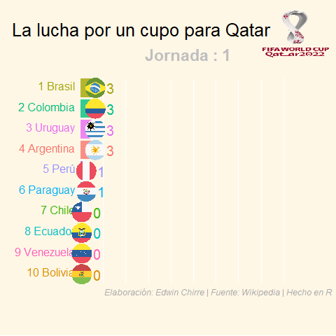
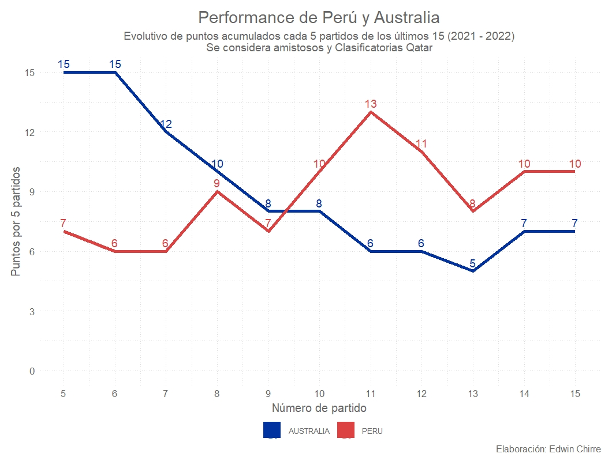

# Gráfico animado de la clasificación para Qatar 2022 

A pocas horas de saber si hay un quinto clasificado sudamericano para el mundial Qatar 2022, me surgió la curiosidad de realizar un gráfico animado sobre cómo han ido cambiando las posiciones de las selecciones a lo largo de las 18 fechas.

<p align="center">
  
</p>


Si quieren replicarlo o hacer uno parecido para las ligas de sus países, les dejaré el [código](https://github.com/EdwinChirre/Grafico_animado_Conmebol/blob/master/Crear_grafico_animado_Conmebol.R) y los pasos a grandes rasgos de cómo pude hacer el gráfico y guardarlo como gif y video.

## Pasos para realizar el gráfico animado

### 1. Importar data desde un URL

Se web scrapea la tabla de posiciones y resultados de cada equipo por fechas. Aquí el [url](https://es.wikipedia.org/wiki/Clasificaci%C3%B3n_de_Conmebol_para_la_Copa_Mundial_de_F%C3%BAtbol_de_2022)

Se hace tratamiento a las tablas para poder adecuarlos a nuestro propósito. Las tablas están [aquí](https://github.com/EdwinChirre/Grafico_animado_Conmebol/tree/master/Data)

  a. data_posiciones_x_fecha.csv: Data armada sobre las posiciones de las selecciones por fechas.
  
  b. data_puntos_x_fecha_acum: Data con los puntos acumulados de las selecciones por fechas.
  
  c. data_final.csv: Data trabajada final (une ambas tablas)

### 2. Crear el gráfico estático

Se genera un gráfico estático con ggplot y se agrega las banderas de las selecciones (ggflags)

```r
staticplot = 
  ggplot(df_final,aes(Posicion, group = Seleccion,country = code,
                      fill = as.factor(Seleccion), color = as.factor(Seleccion))) +
  geom_tile(aes(y = Puntos/2,
                height = Puntos,
                width = 0.9), alpha = 0.8, color = NA) +
  geom_text(aes(y = 0, label = paste(Posicion,Seleccion, " ")), vjust = 0.2, hjust = 1,size = 5.5) +
  geom_text(aes(y=Puntos+2.8,label = as.character(Puntos), hjust=0),size = 7) +
  ggflags::geom_flag(aes(y = Puntos + 0.3), size = 12)+ #agregar las banderas
  
  coord_flip(clip = "off", expand = FALSE) +
  scale_y_continuous(labels = scales::comma) +
  scale_x_reverse() +
  guides(color = "none", fill = "none") +
  theme_cowplot(8)+
  theme(axis.line=element_blank(),
        axis.text.x=element_blank(),
        axis.text.y=element_blank(),
        axis.ticks=element_blank(),
        axis.title.x=element_blank(),
        axis.title.y=element_blank(),
        legend.position="none",
        panel.background=element_rect(fill = '#fff7e6'), 
        panel.border=element_blank(),
        panel.grid.major=element_blank(),
        panel.grid.minor=element_blank(),
        panel.grid.major.x = element_line( size=.1, color="white" ),
        panel.grid.minor.x = element_line( size=.1, color="white" ),
        plot.title=element_text(size=26, hjust=1.6, face="plain", colour="black", vjust=6),
        plot.subtitle=element_text(size=23, hjust=0.5, vjust = 4.5, face="bold", color="gray"),
        plot.caption =element_text(size=12, hjust=-2, face="italic", color="dark gray"),
        plot.background=element_rect(fill = '#fff7e6'),  
        plot.margin = margin(2,2, 2, 4, "cm"))


```

### 3. Crear el gráfico animado

Con gganimate se da vida al gráfico y como adicional, se le agrega el logo de Qatar 

```r
anim = staticplot + 
  annotation_raster(logo_qatar, xmin = 0.5, xmax = 2.8, ymin = 40, ymax = 55) +
  transition_states(as.numeric(substr(Fecha,6,length(Fecha))),
                    transition_length = 4, state_length = 1) +
  ease_aes("cubic-in-out") +
  #view_follow(fixed_x = TRUE)  +
  labs(title = 'La lucha por un cupo para Qatar',
       subtitle  =  "Jornada : {closest_state}",
       caption  = "Elaboración: Edwin Chirre | Fuente: Wikipedia | Hecho en R")

anim

```
### 4. Guardarlo como gif y mp4

Se guardan de la sgte manera:

```r
# Gif
animate(anim, 100, fps = 6.5,  
        renderer = gifski_renderer("evol_posiciones_conmebol.gif"))
# mp4
animate(anim, 100, fps = 6.5,  #width = 600, height = 500,
        renderer = av_renderer('evol_posiciones_conmebol.mp4')) 
```

## BONUS TRACK!

También les comparto el performance de las selecciones de Australia y Perú, para captar tendencia de quién viene mejor en resultados (no necesariamente se refleja en juego). 

Se puede ver como Perú ha ido mejorando y luchando por ese último medio cupo a Qatar, mientras que Australia, empezó bien, y últimamente no viene consiguiendo buenos resultados (expeción su último partido contra EUA).

<p align="center">
  
</p>


### FIN: Espero les haya gustado. Queda pendiente hacerlo en medium paso a paso

        
